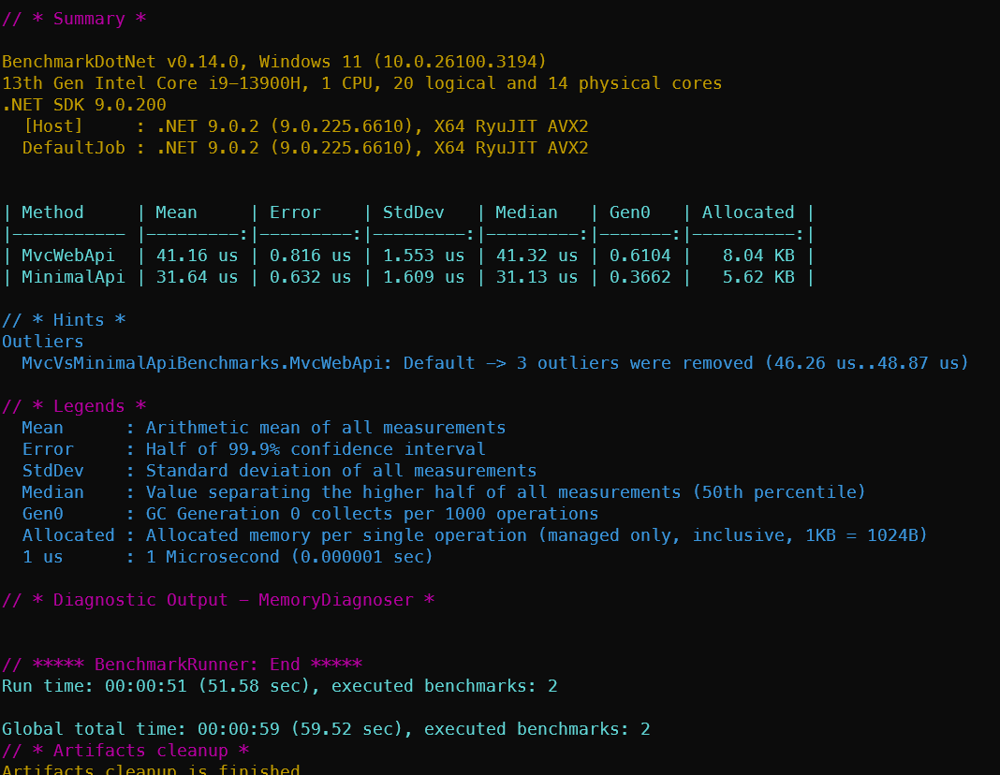

# Demo ASP.NET Core Benchmark

This repository contains some Benchmark tests for [ASP.NET Core](https://learn.microsoft.com/aspnet/core/introduction-to-aspnet-core), written by the aid of [BenchmarkDotNet](https://benchmarkdotnet.org/).

## WebApiBenchmark

The console project in the **WebApiBenchmarks** folder contains a Benchmark between the ASP.NET Core Minimal API Project (***WebApps\SutMinimalApi*** folder) and another ASP.NET Core MVC Web API Project (***WebApps\SutMvcWebApi*** folder).

To run the Benchmark, under the **WebApiBenchmarks** folder, execute the following command in terminal:

```
dotnet run -c Release -- --filter '*'
```

The result will be like this:


